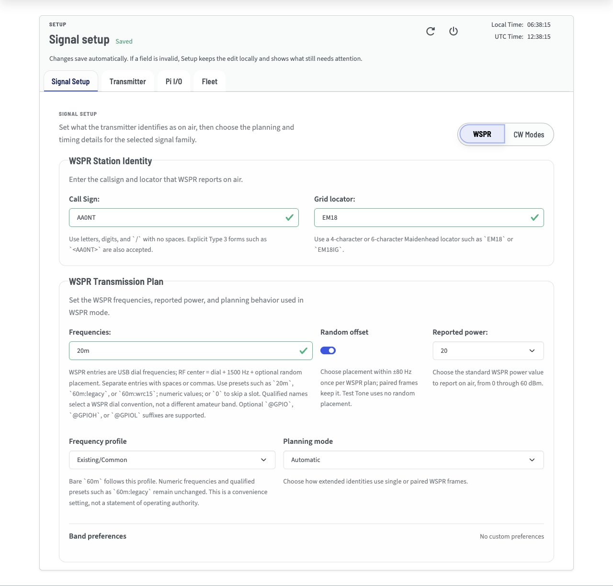

# Setup Card

This card is where your normal day-to-day configuration changes happen. Several settings are intentionally not exposed in the web UI because they are reserved for development and experimental use.

Ordinary Pi host settings autosave after validation. Read the status beside the
Setup title before leaving the page. A saved value may still await runtime
application while committed work owns the transmitter.

Fleet device profiles, output assignments, listener settings, and Pico settings
use explicit saves. Browsing devices or editing these drafts does not trigger
host autosave. **Use Pico** and this Pi's connection fields still save
automatically. Selected-member controls include **Load member resources**,
**Validate hardware plan**, and **Save RF output settings**. See
[member resources](Transmitter/index.md#shared-pico-member-resources) before
saving settings on a Pico. For independent station drafts in Fleet, see
[Save station progress from Fleet](Transmitter/index.md#save-station-progress-from-fleet).
The Pico's own browser save/apply workflow is documented in
[Configure your station in the Pico manual](https://wsprrypico.readthedocs.io/en/devel/configure.html#understand-what-was-saved).

If a change cannot be saved, a brief status appears beside the Setup title. Details about what needs attention appear below the tabs. **Saved** confirms a successful save.

The status beside the Setup title describes this Pi's automatically saved
settings. Fleet explains its save controls in the header; read the feedback
beside each explicit action to confirm its result.

The Setup card is divided into four sub-pages:

- [Configure WSPR and CW](Signal_Setup/index.md) for callsign, mode, and message-related settings.
- [Configure Transmitter](Transmitter/index.md) for hardware output-path selection and related transmission settings.
- [Configure Raspberry Pi I/O](Pi_IO/index.md) for Raspberry Pi pin assignments and indicator behavior.
- [Manage Fleet outputs](Transmitter/index.md#add-a-pico-and-manage-outputs) to
  add a Pico, select a remote output, update Pico firmware over USB, or assign
  independent schedules to saved Pi and Pico devices.

## Pi and Pico Fleet setup

Open **Setup → Fleet** to manage saved Pi and Pico devices and independent
output schedules. No developer-console setting is required. The
[device catalog workflow](Transmitter/index.md#add-a-pico-and-manage-outputs)
explains how to identify and save a profile. Browsing Fleet does not start
transmission. Pi servers use **Plain LAN**;
this implementation does not provide inbound TLS on the Pi.

### Assign an output schedule

Fleet frequency inputs are absolute RF references: WSPR RF center, finite tone
or QRSS carrier, FSKCW space, or DFCW dot. For standard 20m WSPR enter
`14097100`, rather than USB dial `14095600`. Fleet applies no dial conversion
or random placement. FSKCW mark and DFCW dash add the positive shift. Changing
modes updates the labels while preserving draft and saved frequency values.

Fleet assignments and listener settings use explicit save buttons, unlike
ordinary Setup autosave. Review the feedback beside the action before leaving.

1. Save and verify a profile for each target Pi or Pico. For a Pi, use its
   WTP port (default `31417`) and status HTTP port (default `31415`).
2. Select the intended saved device, then choose **Assign a schedule** under
   **Output schedules**. The editor retains that saved-device selection. If no
   matching saved device is selected, choose a **Saved output** explicitly.
   Confirm the output, then enter its mode, RF base frequency in Hz, job
   parameters, repeat period, and UTC phase. For a Pi, confirm **Use Plain LAN
   for this assignment**.
3. Choose **Save assignment**. It starts paused unless **Start this output's schedule
   after saving** is selected. Use **Resume** when ready to run it.

A central Pi supports zero through 32 remote output schedules alongside its
own local schedule. **Use this device** selects the separate single-endpoint
`[WTP]` backend; it does not create an independent output assignment. Saving or
removing a catalog profile also does not create or remove an assignment.

The local schedule does not consume a remote slot. The saved-device catalog holds
up to 64 connection profiles independently of these assignments. The capacity
shown under **Output schedules** includes unresolved contexts retained after a
local takeover; use **Reconcile** to release them before adding another output.
Saved schedules survive restart, including paused states and consumed slots.
Uncertain jobs remain blocked until explicitly reconciled and resumed.

Keep a private backup of Fleet settings. Pause and reconcile affected outputs
before removing assignments; do not edit away recovery barriers or prune the
assignment file by hand.

Each target must advertise support for the assigned job. Native GPIO, RP1 and
Si5351 Pi servers report their WSPR, TONE, QRSS, FSKCW and DFCW capabilities.
The selected backend's processor, route, and frequency policies still apply.
RP1 retains its exact-operation host confirmation; Fleet does not create it.
Pi and Pico jobs are checked against the selected target's reported capabilities. For a Pi profile, set the start-uncertainty limit
to accommodate the reported clock uncertainty, no higher than `500000000` ns
(500 ms); the existing 1 ms default can reject ordinary NTP timing. Values are
never silently increased.

Remote scheduling requires the controller's explicit
[unqualified-frequency permission](../../Command_Line_Operations/transmitter_backends.md#experimental-frequency-policy).
A saved profile or discovered device does not grant that permission.

**Pause and stop**, **Edit schedule**, **Reconcile**, and **Remove assignment**
affect only the selected output. Editing requires a paused, reconciled output.
Failed or uncertain work pauses that assignment; after an interrupted job,
use **Reconcile**, inspect the result, then **Resume**. A consumed schedule slot
is not automatically retried. Other remote outputs and the local schedule
remain independent. A disconnected target has unknown output state; loss of
contact does not prove it stopped.

### Review action results and unsaved entries

Fleet assignment controls report acceptance separately from completion. Read the result beside the affected output before starting another action. An unconfirmed response may follow a successful change; read current status and review it rather than repeating a command blindly. If a controller reply cannot be matched to your action, its result remains unconfirmed and unsaved entries are retained. Reconcile is unavailable while an earlier assignment action is still being processed or the controller inhibits reconciliation. Operations provides the same assignment controls for one selected device, with controller controls kept separate.

Unsaved schedule entries retain their original assignment and reviewed revision. Opening another schedule offers **Continue existing draft**, **Discard draft and open selected schedule**, or **Cancel**. A changed or replaced assignment cannot inherit the draft's authority. New-assignment drafts also retain the reviewed saved output. If that profile changes or its earlier review is unavailable, entries remain visible for inspection and Save is disabled. Discard the draft and reopen the intended output to review it before saving. Failed saves preserve entries; correlated confirmed persistence clears the saved draft.

Removing an output first pauses it and requires confirmed cleanup of this controller's owned work. Failed cleanup retains the paused assignment and recovery duty. Reconcile it, inspect the result, then explicitly remove it again if required. A target-local takeover can remove an assignment independently; its unresolved retained context continues consuming capacity until cleanup is established. Keep the private Fleet recovery files with the assignment state when backing up or restoring configuration. Do not delete them to bypass a recovery block.

### Configure the target Pi

Expand **This Pi's WTP listener** to configure inbound admission, port, and
interface, then choose **Save listener settings**. The listener defaults to enabled on port `31417`. With local Enable
off, it accepts ownership claims after startup confirms safe, idle output.
Local Enable on reserves the output, including gaps between local jobs;
inspection remains available but new claims are refused. Outbound Fleet
schedules do not change either setting.

`auto` selects a single eligible physical LAN IPv4 interface. If several are
eligible, select one explicitly, such as `eth0` or `wlan0`. Avahi advertises the
listener through DNS-SD. If discovery is unavailable, a manual Plain LAN profile
can still use the configured address and port. A discovery entry is only a
connection hint; identify the device before saving it. Plain LAN is unencrypted,
and its observed device ID is not cryptographic authentication.

See [local takeover](../index.md#local-control-and-remote-ownership) before
reclaiming an output from a remote controller, and the
[listener INI reference](../../Advanced_Operations/ini_configuration/runtime.md#wtp-server)
for interface and recovery details.
